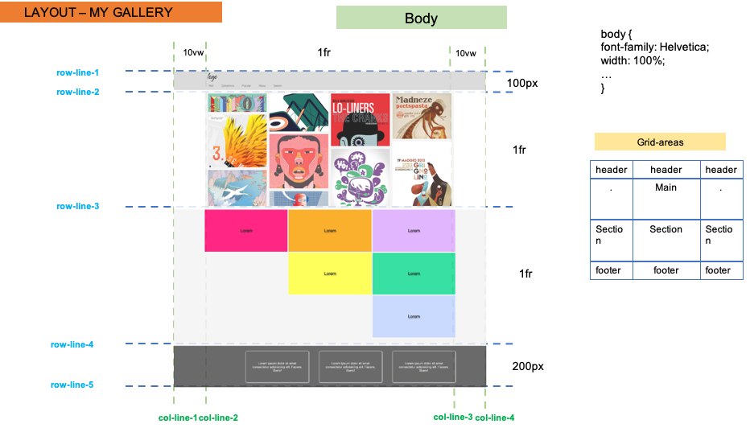

# Grid Document Layout

Verwende CSS Grid (und Flexbox, wenn du willst), um das unten gezeigte Referenzbild zu erstellen.

## Layout-Entwürfe

### Nutze die Bilder und Informationen unten, um die beste Lösung zu finden -

- Das ganze Dokument

- Hauptabschnitt

- Zweiter Teil

- Fußzeile

## Die Online-Version

Um die Live-Version zu sehen, klicke einfach [Klick...!](https://hsnakk.github.io/UIB_Layout_Grid_Exercise-1/)

#### Viel Glück und viel Spaß!
